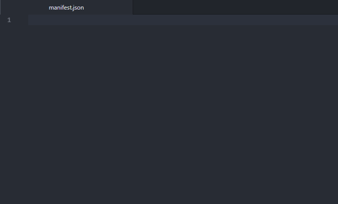
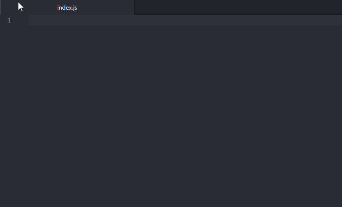

# Vizality Snippets

Some snippets to aid in development of Vizality plugins.

This is a port of [vizality/vscode-snippets](https://github.com/vizality/vscode-snippets). I have removed many snippets since they aren't very useful to me. This package is for any Vizality developers that use use Atom, so basically, just me. If you'd like, I'm open to contributions.

